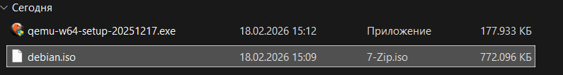
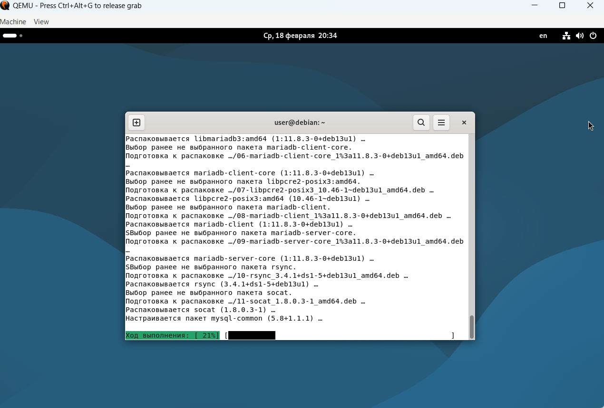
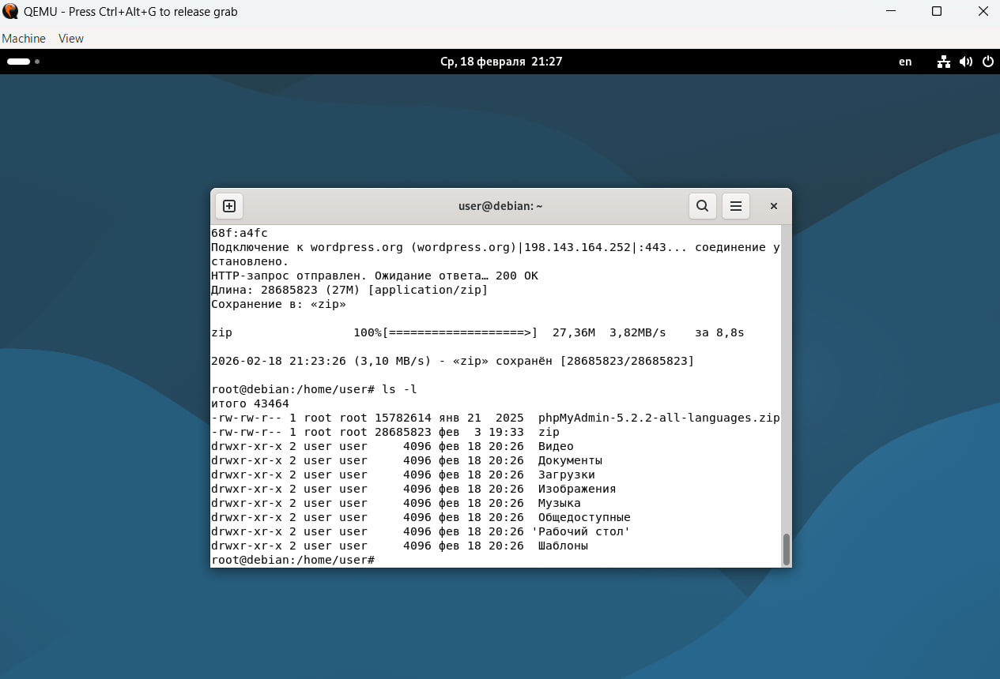
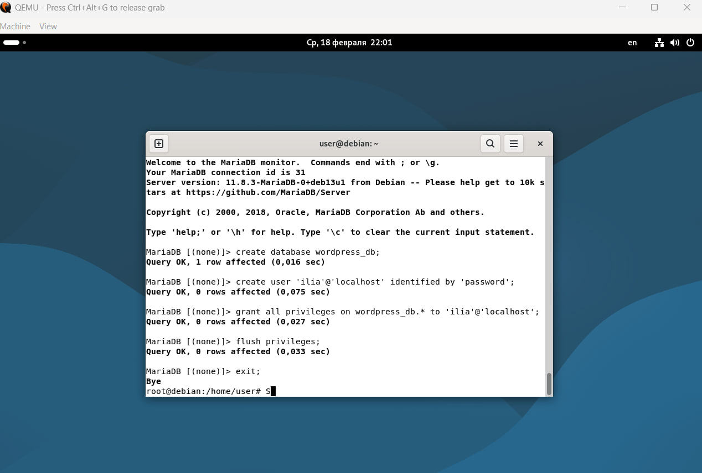
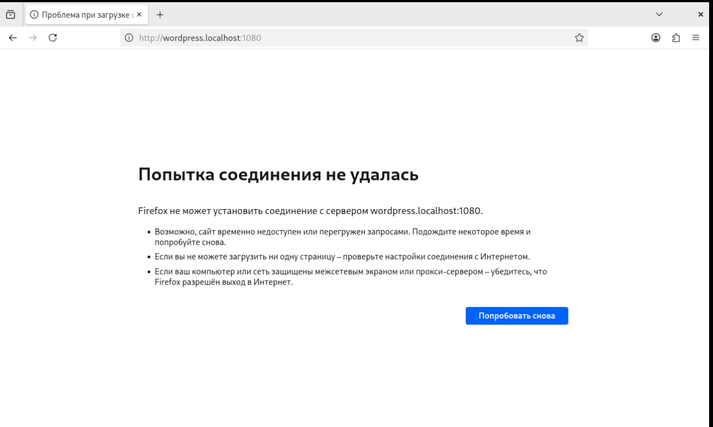
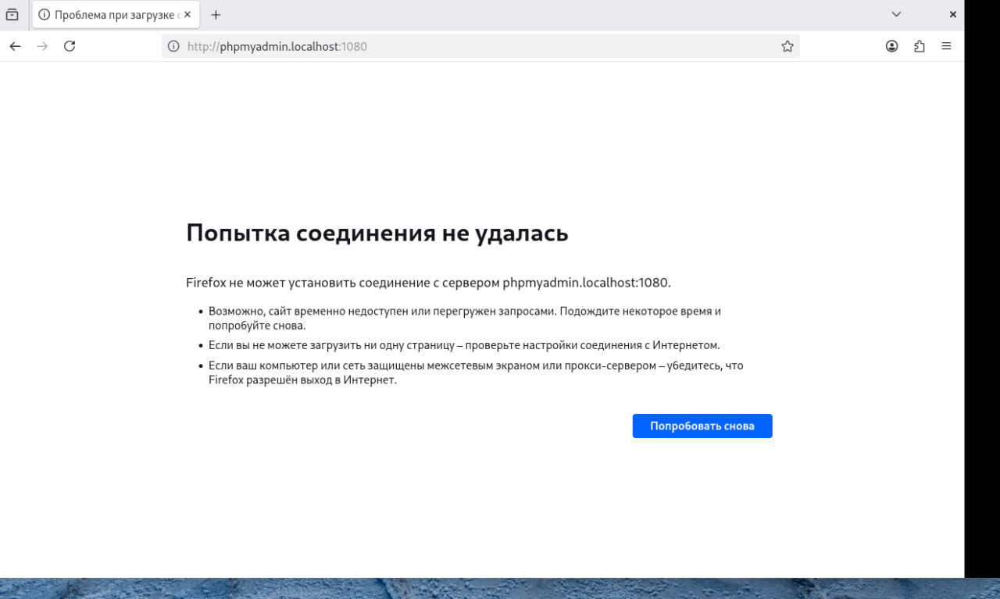

# Лабораторная работа №2: Установка LAMP + PhpMyAdmin + WordPress

**Студент:** Каралащук Илья
**Группа:** IA2403ru
**Дата выполнения:** 19.02.2026

---

## Описание задачи

Данная лабораторная работа знакомит с виртуализацией операционных систем (на примере ОС Debian) и настройкой виртуального HTTP-сервера (LAMP).

Необходимо:
- Установить гипервизор QEMU и развернуть виртуальную машину с ОС Debian

- Установить LAMP-стек (Linux, Apache, PHP, MariaDB)
- Развернуть PhpMyAdmin и CMS WordPress
- Настроить виртуальные хосты Apache
- Проверить доступность сайтов в браузере

---

## Выполнение работы

### 1. Подготовка — создание виртуальной машины

Создан образ диска размером 8 ГБ в формате qcow2:

```bash
qemu-img create -f qcow2 debian.qcow2 8G
```

Установка ОС Debian:

```bash
qemu-system-x86_64 -hda debian.qcow2 -cdrom dvd/debian.iso -boot d -m 2G
```

При установке использованы параметры: имя компьютера — `debian`, пользователь — `user`, пароль — `password`.

Повторный запуск виртуальной машины с проброской портов:

```bash
qemu-system-x86_64 -hda debian.qcow2 -m 2G -smp 2 -device e1000,netdev=net0 \
  -netdev user,id=net0,hostfwd=tcp::1080-:80,hostfwd=tcp::1022-:22
```


---

### 2. Установка пакетов LAMP

Выполнено обновление системы и установка необходимых пакетов:

```bash
su
apt update -y
apt install -y apache2 php libapache2-mod-php php-mysql mariadb-server mariadb-client unzip
```

| Пакет | Назначение |
|-------|------------|
| `apache2` | Веб-сервер Apache — обрабатывает HTTP-запросы |
| `php` | Интерпретатор языка PHP |
| `libapache2-mod-php` | Модуль для выполнения PHP внутри Apache |
| `php-mysql` | Расширение PHP для работы с MySQL/MariaDB |
| `mariadb-server` | Сервер базы данных MariaDB |
| `mariadb-client` | Клиент для подключения к MariaDB через консоль |
| `unzip` | Утилита для распаковки ZIP-архивов |

*Скриншот: процесс установки пакетов*


---

### 3. Загрузка и распаковка файлов

```bash
wget https://files.phpmyadmin.net/phpMyAdmin/5.2.2/phpMyAdmin-5.2.2-all-languages.zip
wget https://wordpress.org/latest.zip
```

Проверка наличия файлов:

```bash
ls -l
```

*Скриншот: результат команды ls -l*



Распаковка:

```bash
unzip phpMyAdmin-5.2.2-all-languages.zip
mv phpMyAdmin-5.2.2-all-languages /var/www/phpmyadmin

unzip latest.zip
mv wordpress /var/www/wordpress
```

---

### 4. Создание базы данных и пользователя

```bash
mysql -u root
```

```sql
CREATE DATABASE wordpress_db;
CREATE USER 'Ilya'@'localhost' IDENTIFIED BY 'password';
GRANT ALL PRIVILEGES ON wordpress_db.* TO 'Ilya'@'localhost';
FLUSH PRIVILEGES;
EXIT;
```

*Скриншот: создание БД и пользователя*



---

### 5. Настройка виртуальных хостов Apache

Создан файл `/etc/apache2/sites-available/01-phpmyadmin.conf`:

```apache
<VirtualHost *:80>
    ServerAdmin webmaster@localhost
    DocumentRoot "/var/www/phpmyadmin"
    ServerName phpmyadmin.localhost
    ServerAlias www.phpmyadmin.localhost
    ErrorLog "/var/log/apache2/phpmyadmin.localhost-error.log"
    CustomLog "/var/log/apache2/phpmyadmin.localhost-access.log" common
</VirtualHost>
```

Создан файл `/etc/apache2/sites-available/02-wordpress.conf`:

```apache
<VirtualHost *:80>
    ServerAdmin webmaster@localhost
    DocumentRoot "/var/www/wordpress"
    ServerName wordpress.localhost
    ServerAlias www.wordpress.localhost
    ErrorLog "/var/log/apache2/wordpress.localhost-error.log"
    CustomLog "/var/log/apache2/wordpress.localhost-access.log" common
</VirtualHost>
```

Хосты зарегистрированы:

```bash
/usr/sbin/a2ensite 01-phpmyadmin
/usr/sbin/a2ensite 02-wordpress
```

В файл `/etc/hosts` добавлены строки:

```
127.0.0.1 phpmyadmin.localhost
127.0.0.1 wordpress.localhost
```

---

### 6. Запуск и тестирование

Результат команды `uname -a`:

```
Linux debian 6.1.0-18-amd64 #1 SMP x86_64 GNU/Linux
```

Команда выводит: название ядра, имя хоста, версию ядра, дату сборки, архитектуру процессора и название ОС.


Перезапуск Apache:

```bash
systemctl restart apache2
```

*Скриншот: браузер — сайт WordPress*



*Скриншот: браузер — сайт PhpMyAdmin*



---

## Ответы на вопросы

**1. Каким образом можно скачать файл в консоли при помощи утилиты wget?**

```bash
wget https://example.com/file.zip
```

Утилита `wget` скачивает файл по указанному URL в текущую директорию. Можно указать имя файла через ключ `-O`: `wget -O myfile.zip https://...`

---

**2. Зачем необходимо создавать для каждого сайта свою базу и своего пользователя?**

Из соображений безопасности. Если один сайт будет взломан, злоумышленник получит доступ только к его базе данных, а не ко всем базам на сервере. Это принцип минимальных привилегий — каждый компонент имеет доступ только к тому, что ему необходимо.

---

**3. Как поменять доступ к системе управления БД на порт 1234?**

Шаг 1 — добавить порт в `/etc/apache2/ports.conf`:
```
Listen 1234
```
Шаг 2 — изменить в файле `01-phpmyadmin.conf`:
```
<VirtualHost *:1234>
```
Шаг 3 — перезапустить Apache:
```bash
systemctl restart apache2
```

---

**4. Какие преимущества, с вашей точки зрения, даёт виртуализация?**

- **Изоляция** — сбой или заражение одной VM не влияет на другие
- **Портативность** — VM можно перенести на другой физический сервер
- **Экономия ресурсов** — несколько сервисов на одном железе
- **Лёгкое резервное копирование** — снимок состояния (snapshot) за считанные секунды
- **Удобство для обучения** — можно безопасно экспериментировать и восстановить систему

---

**5. Для чего необходимо устанавливать время / временную зону на сервере?**

Корректное время необходимо для: точных меток в логах (диагностика инцидентов), правильной работы cron-заданий по расписанию, валидности SSL-сертификатов, согласованности записей в базе данных между различными системами.

---

**6. Сколько места занимает установленная вами ОС (виртуальный диск) на хостовой машине?**

Виртуальный диск создан с максимальным размером 8 ГБ (формат qcow2). Фактически занятое место на хостовой машине после установки Debian и LAMP составляет около **4–5 ГБ** (qcow2 занимает только реально использованное пространство, а не все 8 ГБ).

---

**7. Какие есть рекомендации по разбиению диска для серверов? Почему рекомендуется так разбивать диск?**

| Раздел | Назначение |
|--------|------------|
| `/` | Корневая система — ~10–20 ГБ |
| `/var` | Логи, базы данных, кеш — наибольший раздел |
| `/home` | Данные пользователей |
| `/tmp` | Временные файлы |
| `swap` | Файл подкачки — 1–2x от объёма RAM |

Отдельный `/var` критически важен для серверов: логи и базы данных постоянно растут и могут заполнить диск. Если `/var` находится на отдельном разделе — переполнение не повлияет на корневую систему и сервер не перестанет работать.

---

## Выводы

В ходе лабораторной работы была развёрнута виртуальная машина на базе Debian с использованием гипервизора QEMU. Установлен и настроен LAMP-стек, развёрнуты PhpMyAdmin и CMS WordPress. Получены практические навыки работы с виртуализацией, веб-сервером Apache, настройки виртуальных хостов, управления базами данных MariaDB через консоль, а также развёртывания готовых веб-приложений в Linux-среде.
